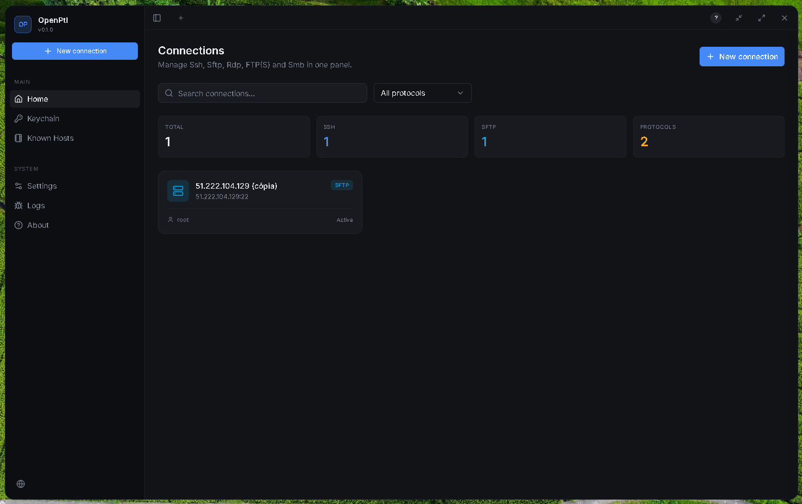
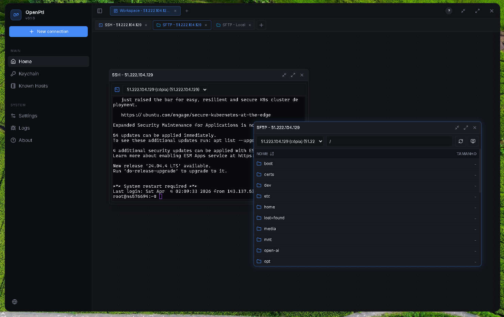
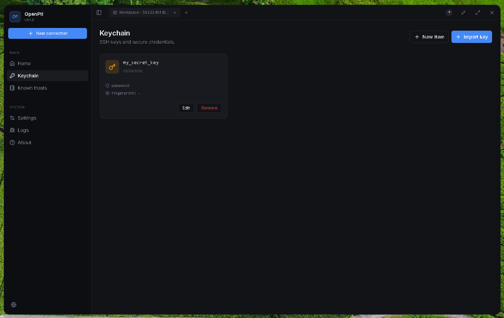
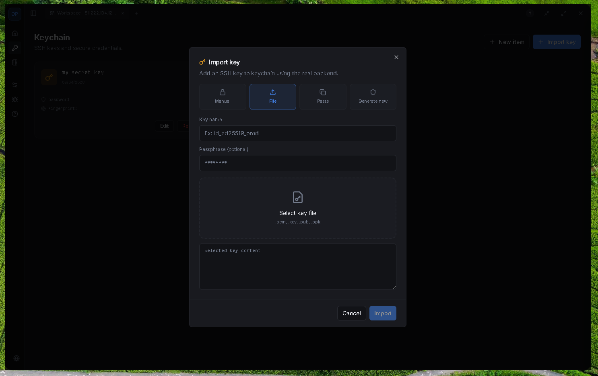
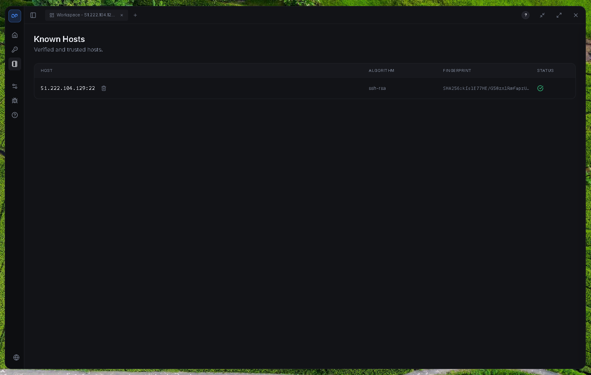
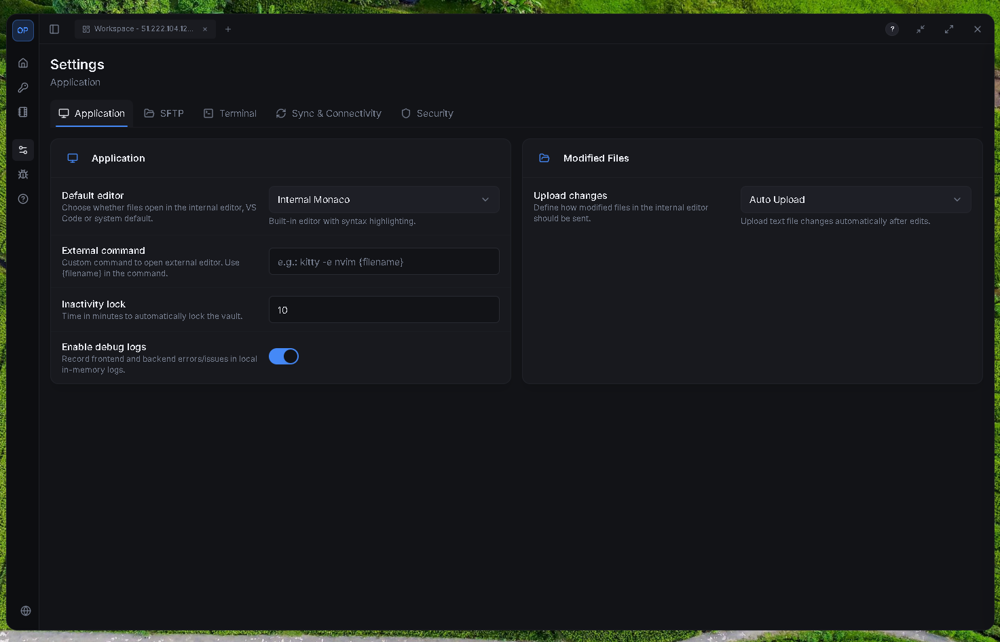
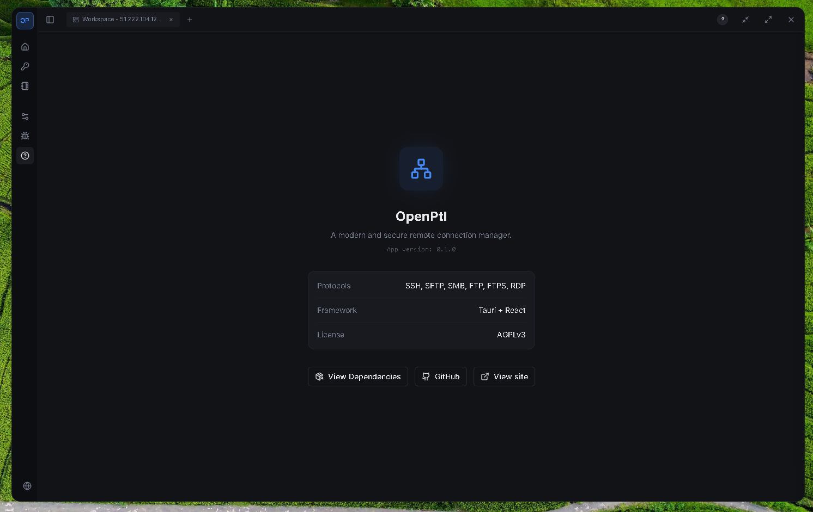
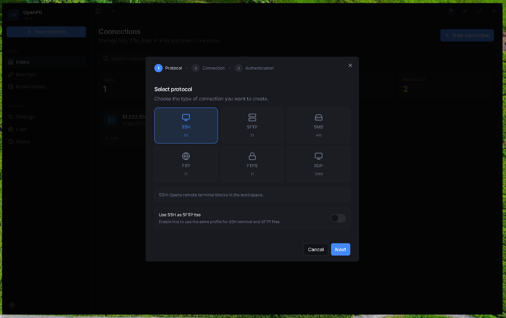

# OpenPtl (OP)

OpenPtl is a multi-protocol desktop remote workspace built with **Tauri + React**.  
It combines terminals, remote file management, encrypted local persistence, and Google Drive cloud sync for profile data.

## Screenshots










## Supported protocols

- SSH
- SFTP
- FTP
- FTPS
- SMB
- RDP

## What OpenPtl does

- Encrypted vault for profiles/settings:
  - master password mode (`Argon2id` + `XChaCha20-Poly1305`)
  - keychain-backed mode (generated key stored in OS keychain)
- Workspace tabs with draggable/resizable blocks
- SSH terminal sessions (PTY-backed) with live event streaming
- Remote file blocks for SFTP/FTP/FTPS/SMB operations
- RDP session blocks for remote desktop workflows
- Internal Monaco editor + open in external editor
- Google Drive sync for encrypted profile backup (appDataFolder + OAuth flow)
- Custom desktop shell (header/sidebar/tabs/workspaces) in Tauri

## Architecture

- Frontend: `React + TypeScript + Zustand + Vite`
- Backend: `Rust + Tauri 2`
- Key backend modules:
  - `src-tauri/src/lib.rs`: command surface and app bootstrap
  - `src-tauri/src/ssh.rs`: SSH/SFTP session handling
  - `src-tauri/src/libs/*`: shared libraries (vault, sync, transfers, tasks)
  - `src-tauri/src/protocols/*`: protocol-specific adapters

## Requirements

- Node.js 20+ (or Bun)
- Rust stable toolchain
- Tauri v2 system prerequisites for your OS

## Development

### Option 1: npm

```bash
npm install
npm run tauri dev
```

### Option 2: Bun

```bash
bun install
bun run tauri dev
```

## Build and tests

```bash
bun run build
cargo test --manifest-path src-tauri/Cargo.toml
```

You can also use npm equivalents:

```bash
npm run build
cargo test --manifest-path src-tauri/Cargo.toml
```

## Auth worker (Google OAuth broker)

The optional auth worker lives in `server/` and is used by sync/auth flows.

```bash
cd server
npm install
npm run dev
```

Environment variables for the worker:

- `GOOGLE_CLIENT_ID`
- `GOOGLE_CLIENT_SECRET`
- `ALLOWED_ORIGINS` (configured in `server/wrangler.toml`)

## Notes

- Deep link callback scheme: `openptl://auth`
- Transfer progress events follow `transfer:progress:{id}`
- Default auth server list is in `auth-servers.json`
